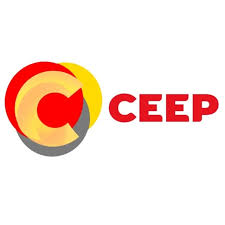
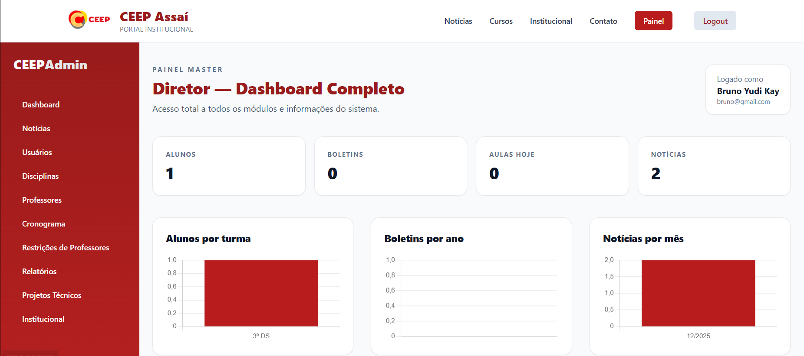
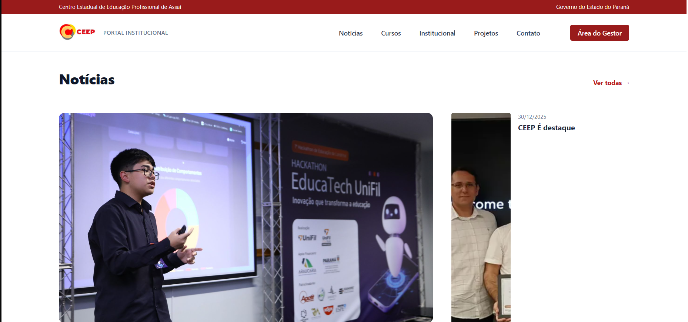
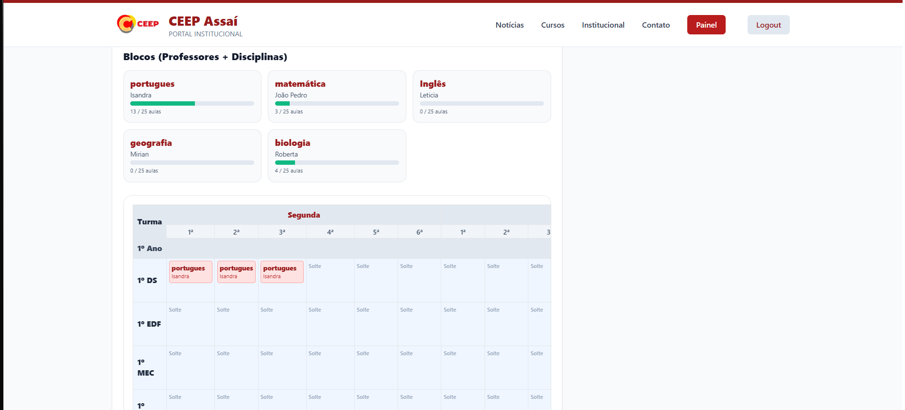

# 📘 CEEPapp — Portal Acadêmico e Administrativo do CEEP Assaí

<p align="center">
  
</p>

<p align="center">
  
  
  
  
</p>

---

## 🧠 Sobre o Projeto

O **CEEPapp** é uma plataforma web desenvolvida para centralizar e modernizar a **gestão acadêmica, administrativa e comunicacional** do **Centro Estadual de Educação Profissional Profª Maria Lydia Cescatto Bomtempo (CEEP Assaí – PR)**.

Projetado para uso real em ambiente educacional, o sistema possui **controle de permissões**, **painel administrativo**, **gestão de notícias**, **cronogramas acadêmicos** e uma interface moderna, segura e escalável.

---

## 🖥️ Demonstração Visual

<p align="center">
  
  
  
</p>

---

## 🚀 Funcionalidades Principais

* 🔐 Autenticação e controle de permissões
* 📰 Gestão completa de notícias institucionais
* 📅 Cronograma acadêmico interativo
* 🧑‍💼 Painel administrativo exclusivo
* 🎨 Interface moderna e responsiva

---

## 🛠️ Stack Tecnológica

**Backend**

* PHP 8.3
* Laravel 12
* PostgreSQL

**Frontend**

* Blade Templates
* Tailwind CSS
* JavaScript

---

## 📂 Estrutura do Projeto

```
app/
 ├─ Helpers/
 ├─ Http/
 │   ├─ Controllers/
 │   └─ Middleware/
resources/
 ├─ views/
 │   ├─ admin/
 │   ├─ auth/
 │   └─ layouts/
database/
 ├─ migrations/
 └─ seeders/
public/
 └─ assets/
```

---

## 🔒 Segurança

* Middleware de autenticação
* Controle de acesso por cargo
* Validações de dados no backend

---

## 🎯 Objetivo

Criar uma base digital sólida para instituições educacionais, centralizando informações, processos internos e comunicação institucional, com foco em escalabilidade e segurança.

---

## 👨‍💻 Autor

**Bruno Yudi Kay**
Desenvolvedor Full-Stack | IA | Sistemas Educacionais
GitHub: [https://github.com/brunoxzr](https://github.com/brunoxzr)

---

## 📌 Status

🟢 Em desenvolvimento ativo
